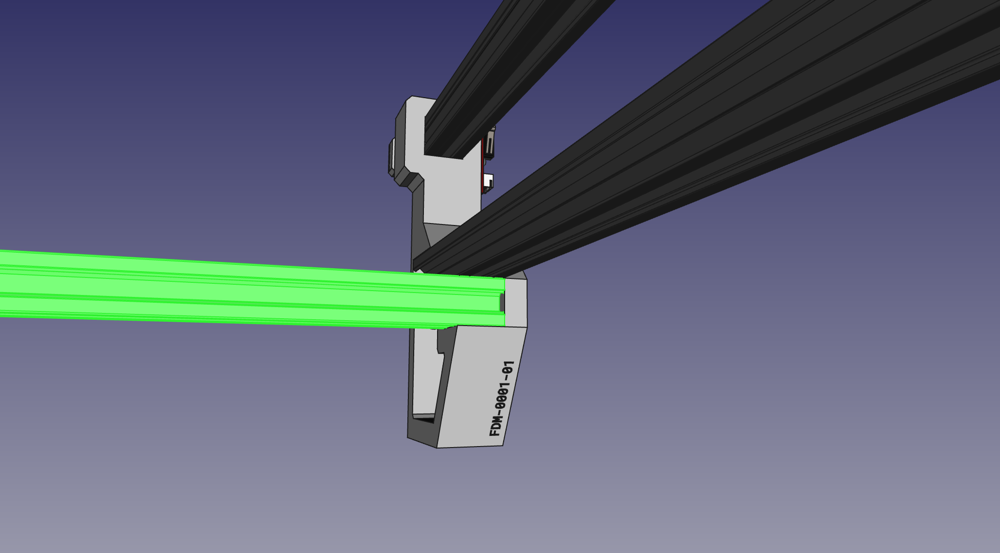
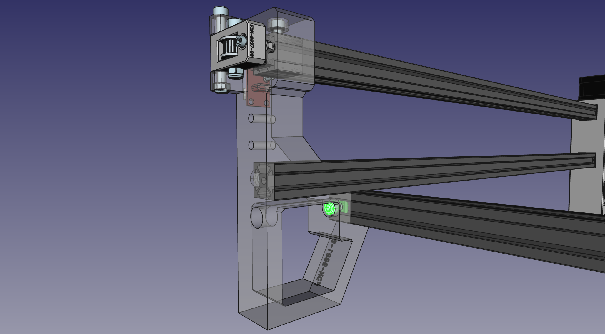
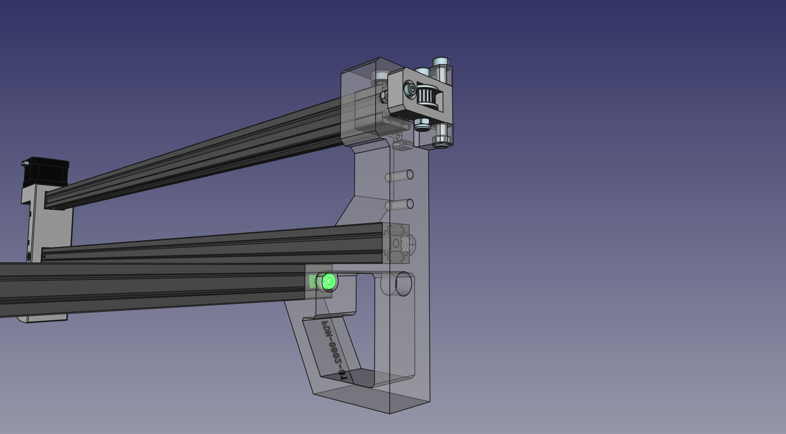
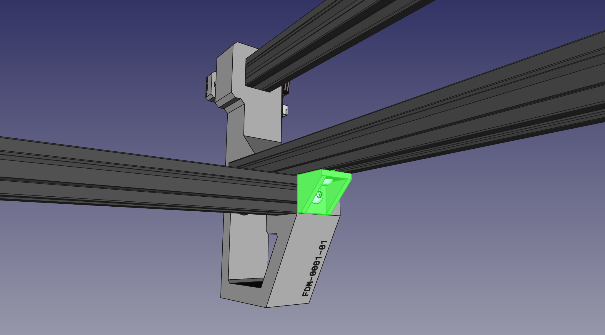
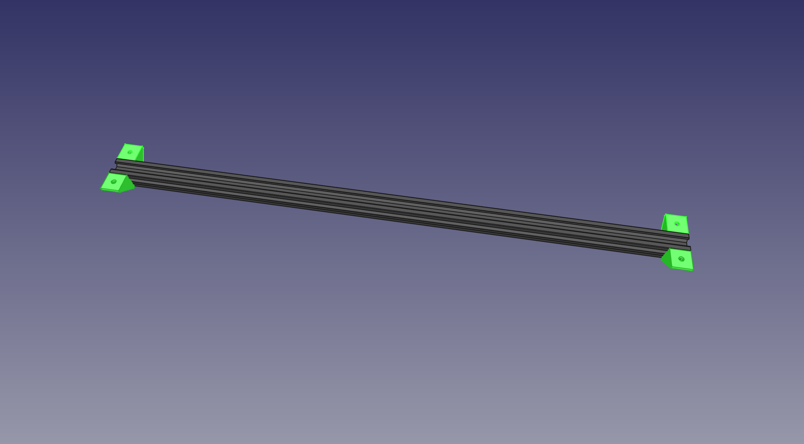
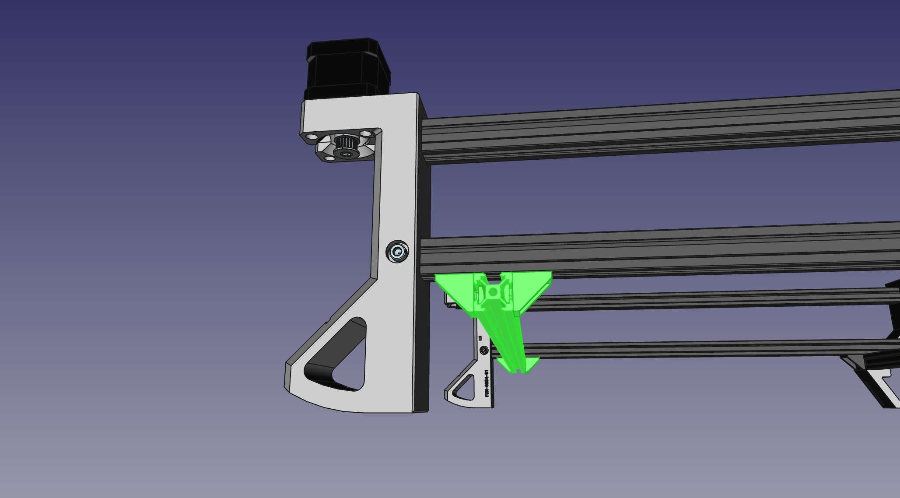
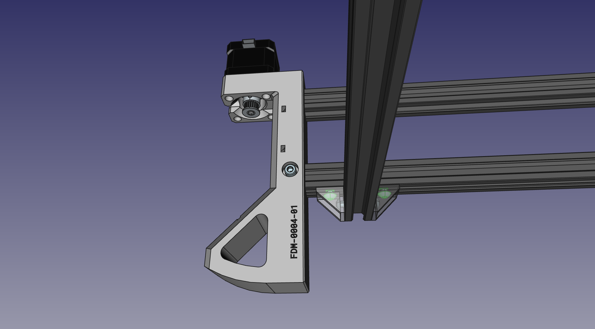
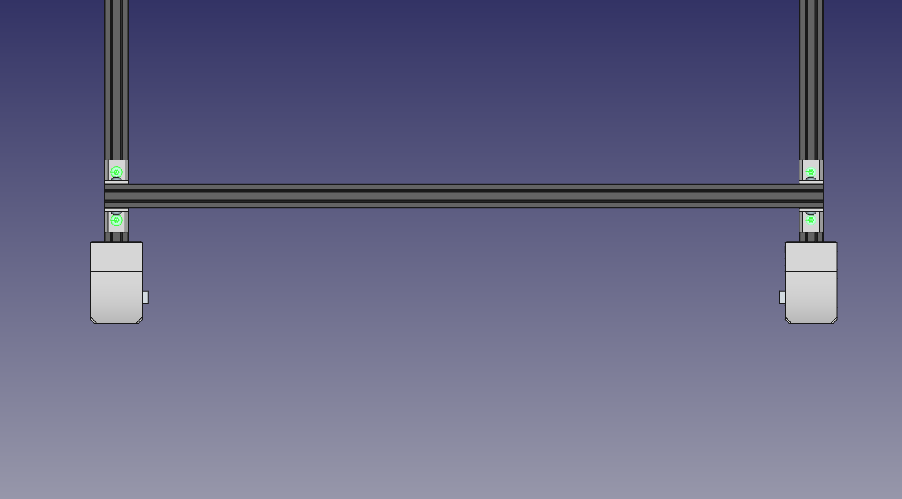

# Connecting the Sides

Now we're going to combine the left and right side together using two aluminum extrusions, and the staging plate.

| Qty | Part                       |
|----:|----------------------------|
|   2 | Aluminum extrusion         |
|  16 | M5 T-slot nut              |
|   4 | M5x10 machine screw        |
|  12 | M5x8 machine screw         |
|   6 | 2020 Corner Bracket        |
|   1 | FDM-0022 (Umbilical Guide) |

1. Insert a new v-slot extrusion (in green below) into the `Front Left Leg` underneath the bottom rail.
  
  
  
  

1. Drop in and position a slot nut underneath the hole and use a M5x10mm machine screw to fasten the v-slot extrusion to the `Front Left Leg`.
  

1. Drop in and position a slot nut underneath the hole and use a M5x10mm machine screw to fasten the v-slot extrusion to the `Front Right Leg`.
  

1. Attach one of the included metal 2020 corner bracket to the 20x20 V-Slot on the left side using two slot nuts and two M5x8mm screws.
  

1. Attach a 2020 corner bracket to the 20x20 V-Slot on the right side using two slot nuts and two M5x8mm screws.
  

1. Fasten the `Umbilical Guide` on the bottom side of the bottom rail of the left side in place using two M5x10mm screws and two slot nuts.
  

1. Affix a 2020 corner bracket to the end of another V-slot using the a slot nut and an M5x8mm screw. Make sure the side of the bracket is perfectly flush with the end of the extrusion. It helps to tighten it in place against a flat surface.
  

1. Repeat the previous step three times to install three more braces in the orientation shown below. This is the back rail.
  

1. Flip the machine upside down. Using four M5x8mm screws and four slot nuts, fasten the back rail to the left and right sides of the machine as shown below. Make sure that the ends of the back rail are perfectly flush with the sides of the extrusion on the left and right sides. This will help keep the machine square. The brackets do not need to be touching the printed feet.
  
  
  
  

## Next steps

Continue to assembling the [Y Gantry](../y-gantry-assembly/index.md).