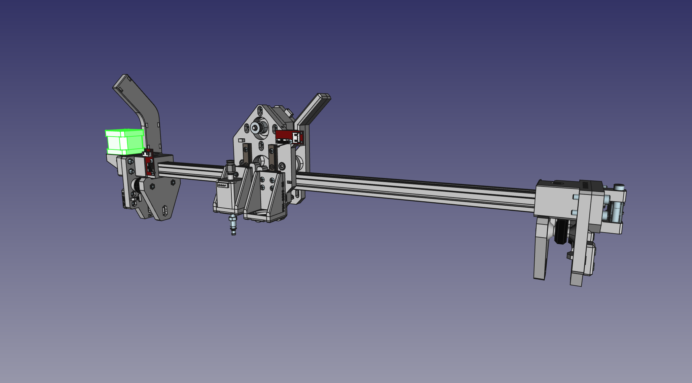
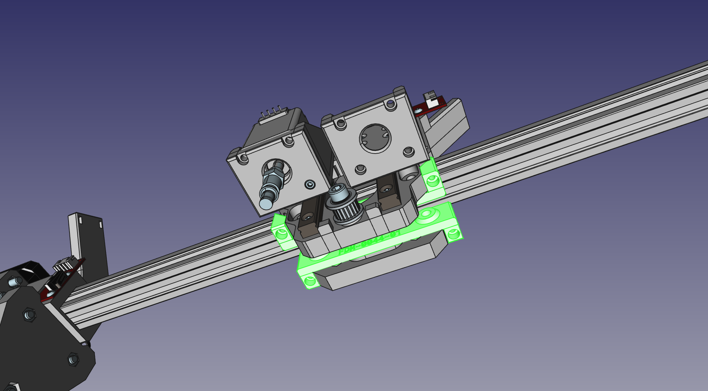
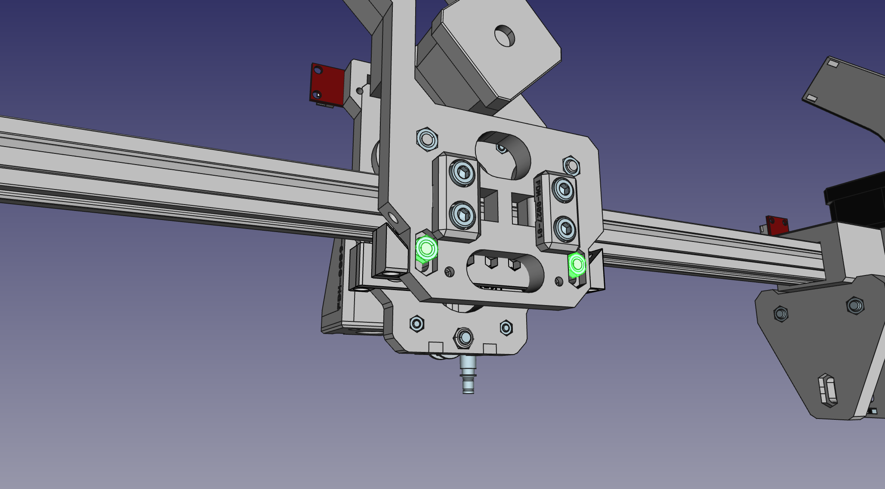
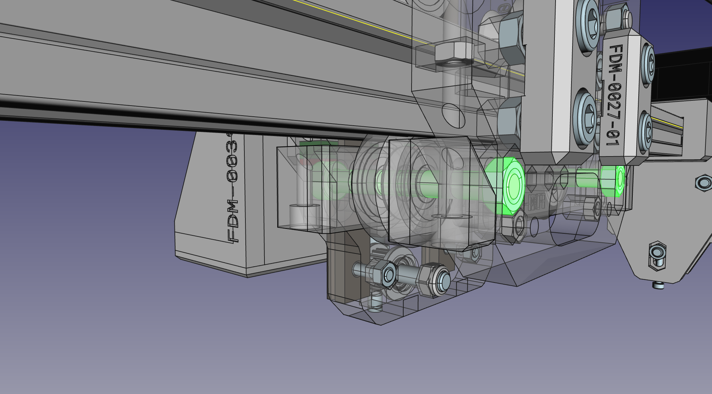
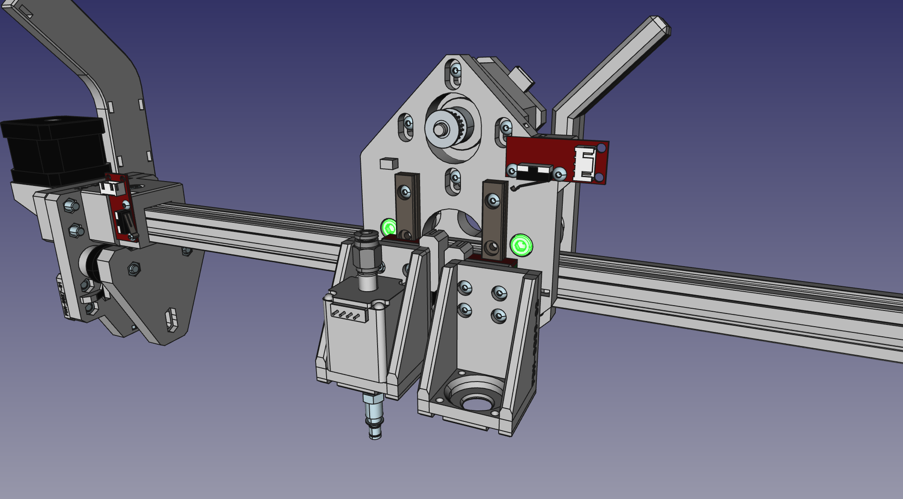
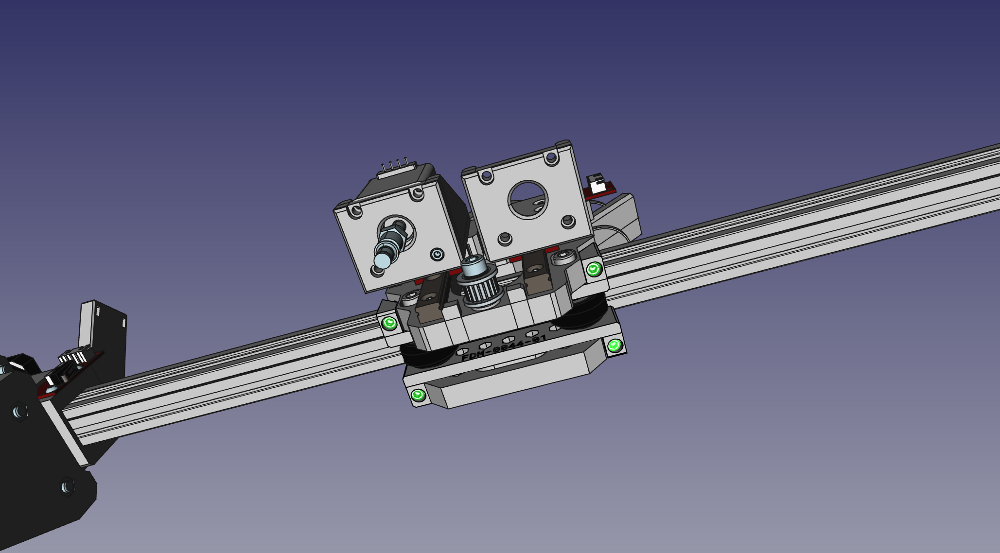
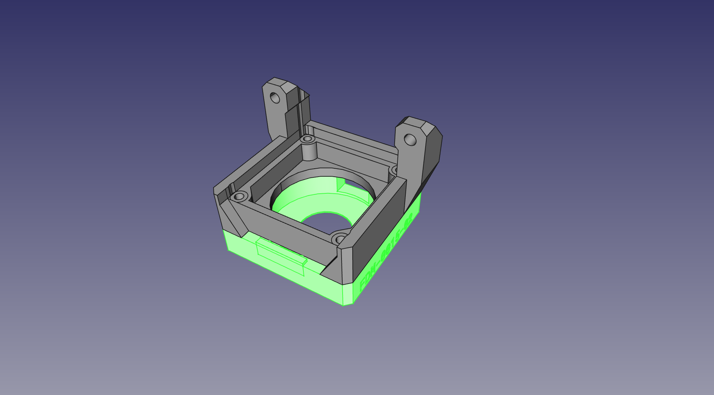
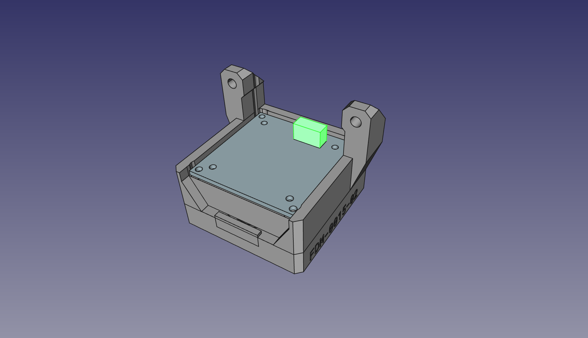
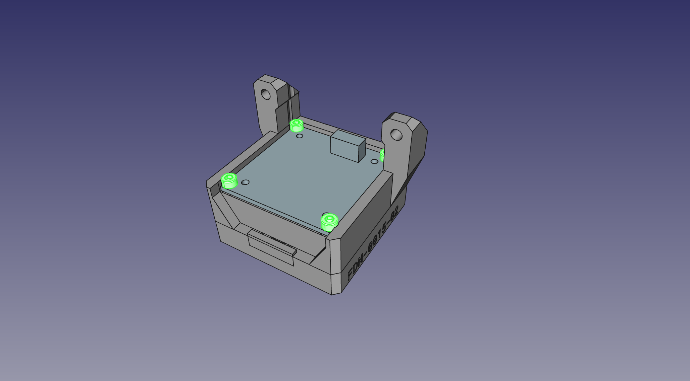
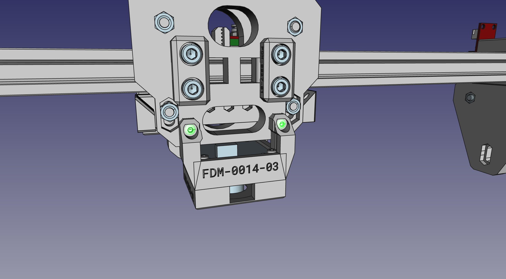

# Mounting the X Gantry to the Y Gantry

Now that we have both gantries assembled, it's time to put them together.

## X Gantry Tensioner Bars

| Qty | Part                            |
|----:|---------------------------------|
|   2 | V-slot roller wheel             |
|   2 | FDM-0043 (X Gantry Tension Bar) |
|   2 | M5x40 machine screw             |
|   2 | M5 Hex Nut                      |
|   4 | M3x30 machine screw             |

1. Fit the X gantry on top of the Y gantry rail. Make sure the X motor is on the left side with the front of the X gantry facing you.

    !!! danger "Note"
        You'll find that it's hard to fit the X gantry onto the rail. This is because of a few protrusions on the back plate that hold the belt at the right distance. Loosening the M5x40mm bolts holding the two halves of the X gantry together will help it slot onto the rail.
  

1. Prepare two V-slot rollers. You may need to align one or both of the interior washers inside the rollers, as they can shift in shipping and block the hole for the screw. Simply push the washers back into place with a screwdriver tip.

2. With the top roller bolts still loose, slide the two `X Gantry Tension Bars`.
  
  

1. Now we can secure the stack in place using two M5x40mm bolts. Pass them through the holes, and loosely tighten them into two M5 nuts in the slots on the `X Gantry Back`. Don't tighten all the way yet; we still have some adjustment to do first.
  
  
  

1. Tighten the **top** roller bolts now that everything is in its place.
  

1. Now we add tension screws. These are what hold the `X Gantry Tension Bars`, as shown below. Make sure each screw is tightened the same amount, and that the X gantry can still move freely, but doesn't have any wiggle on the rail.
  
  

1. Tighten the M5x40mm bolts that run through the bottom set of rollers (installed in the previously) so that their position is locked.
  

## Camera and Ring Light

| Qty | Part                        |
|----:|-----------------------------|
|   1 | USB Camera (Top)            |
|   1 | FDM-0015 (Top Light Mount)  |
|   1 | FDM-0014 (Top Camera Mount) |
|   1 | Top Ring Light PCB          |
|   4 | M2.5x20 machine screw       |
|   2 | M3x14 machine screw         |
|   1 | Super Lube                  |

!!! info "Note"
    There's a piece of black electrical tape on the back of the camera PCB. Don't remove it; it is there to help isolate the camera sensor from light shining through vias in the PCB.

1. Before mounting the camera, you'll need to make sure you can rotate the lens and adjust the camera's focus. First carefully remove the set screw on the side of the lens assembly that is holding the lens in place. Next, unscrew the lens from the camera. You might need a light grip with pliers (preferably with soft grips) to get it to turn. With the lens removed, use a cotton swab to apply a **very small** amount of Super Lube to the lens threads. Be careful not to get any of the lubricant inside or on the lens. Wipe off any excess with a cotton swab or microfiber cloth. If necessary, you can clean the lens itself using a microfiber cloth. Screw the lens back into the camera and work the lubricant into the threads. Save the lubricant as you'll use it again later. Finally, add the set screw back to the side of the lens assembly. Tighten the set screw just enough to keep the lens in place but not so much that it prevents you from adjusting the lens with a little force, as you'll need to adjust the lens after the camera is mounted.

2. Place the ring light facing downwards into the `Top Light Mount`. The LEDs will shine down, and the white plastic wire connector will face upwards.
  
  

1.  Place the `Top Camera Mount`. These two prints will pinch the top ring light in place.
  

1.  Install the Top Camera into the `Top Camera Mount`.
  
  

1.  Secure the whole stack in place with four M2.5x20mm screws in the outer four holes (not the ones with a metal circle around them). Tighten them down so that all parts are tightly held together, but don't over-torque; these screws are threading into the plastic of the `Top Light Mount`.
  

1.  Use two M3x14mm screws to mount the Top Camera and Light subassembly onto the back of the `X Gantry Back`.
  

## Next steps

Continue to [mounting the Y Gantry to the Frame](../mount-y-to-frame/index.md).
