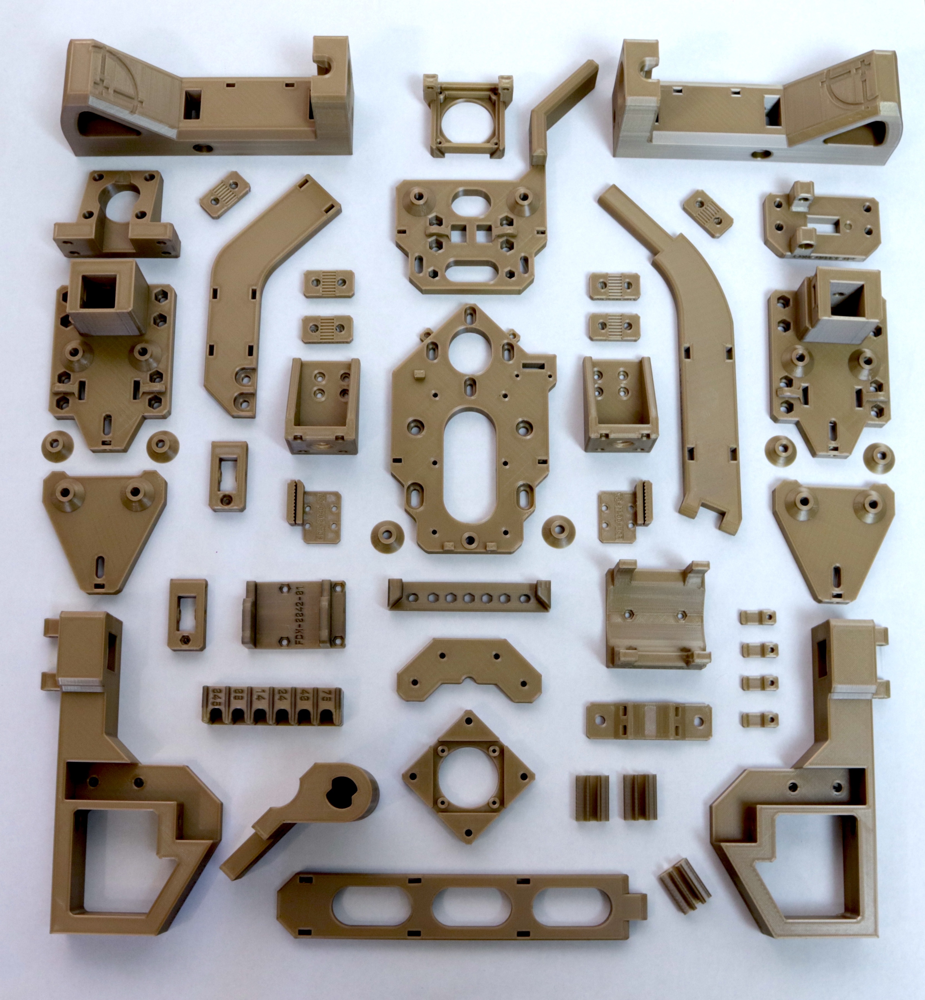

#Printing Parts

## Getting The Part Models

Alright, time to get the parts we need to print! You can find the parts you need on the [Releases Page](https://github.com/opulo-inc/lumenpnp/releases), and look at the attached Assets at the bottom of the release. Click and download both `LumenPnP-STLs` and `LumenPnP-BOM` to get the STL files and BOM for your machine.

## Printer Requirements

These parts are designed to fit onto a printer with a build volume of at least 18 x 18 x 18 cm, such as the Prusa MINI. Although not recommended, it's possible to print the parts on a smaller printer with some creative placements.

Additionally **these parts are designed for printers with a 0.4mm nozzle.** Using a larger nozzle diameter can result in some features not resolving correctly, or parts not fitting as designed.

## Material

These parts are designed for PLA, however, some folks have printed the parts successfully with PETG. You'll need about 1 kg of the primary filament.

There are three situations where you'll need specific filament colors:

- White or transparent filament for the light mounts, `top-light-mount` and `bottom-light-mount`. These parts act as light diffusers for the ring lights.
- White or light colored filament for the `nozzle-rack`. This helps with setting up the automatic tool changer.
- A darker filament for the Z gantries, `z-gantry-left` and `z-gantry-right`. This helps the bottom camera distinguish the nozzle tip from the rest of the gantry. If you print in a lighter color anyway you can use a bit of blue painter's table on the bottom side of the gantry.

## Print settings

There are two different print setting profiles you'll need for printing the parts. We use PrusaSlicer's setting names, but you should be able to adapt them if you use a different slicer. Every printer is a little different, but these settings should be a reasonable starting point. You can tune them as needed once you print the calibration print in the next step.

### Default Settings

These settings are used for the majority of the parts:

- [Layer height](https://help.prusa3d.com/article/layers-and-perimeters_1748#layer-height): 0.2 mm
- Vertical shells > [Perimeters](https://help.prusa3d.com/article/layers-and-perimeters_1748#perimeters): 3
- Infill > [Fill density](https://help.prusa3d.com/article/infill_42#fill-density): 20%
- Horizontal shells > [Solid Layers](https://help.prusa3d.com/article/layers-and-perimeters_1748#solid-layers-top-bottom): 5 for top and bottom
- Support material > [Generate support material](https://help.prusa3d.com/article/support-material_1698#generate-support-material): yes

### Gantry Settings

These settings are used for parts that require more strength:

- [Layer height](https://help.prusa3d.com/article/layers-and-perimeters_1748#layer-height): 0.2 mm
- Vertical shells > [Perimeters](https://help.prusa3d.com/article/layers-and-perimeters_1748#perimeters): 4
- Infill > [Fill density](https://help.prusa3d.com/article/infill_42#fill-density): 30%
- Horizontal shells > [Solid Layers](https://help.prusa3d.com/article/layers-and-perimeters_1748#solid-layers-top-bottom): 5 for top and bottom
- Support material > [Generate support material](https://help.prusa3d.com/article/support-material_1698#generate-support-material): yes

Use gantry settings for the following parts:

- y-gantry
- y-gantry-support
- roller-spacer
- x-gantry-front
- x-gantry-back
- x-idler-mount
- z-gantry-left
- z-gantry-right

## Calibration Print

**Before printing the parts, print the calibration part**. This part contains every feature- screw holes, nut slots, extrusion profiles, etc.- used in the printable parts. Printing this first ensures your printer calibration and print settings are correct.

This is the **calibration print**, colloquially referred to as ["the corndog"](https://github.com/opulo-inc/lumenpnp-archive/releases/download/v2.1.3/FDM-8000_corndog.stl). This part isn't currently included in the exported STLs, so grab it from the link above.

After printing, you can check fit of various fasteners and one of the aluminum extrusions to ensure the parts you print will all fit as expected:

- Check that M3 and M5 bolts fit through their counter-sunk holes.
- Check that M3 and M5 nuts fit in both hexagonal voids and vertical nut slots.
- Check that M3 and M5 bolts can be self-tap through the two holes inside the lock icon. They should take some effort, but they should grip well into the print.
- Check that the 20 x 20 mm aluminum extrusion fits into the square hole.

Once you're happy with the fit you can start printing the parts.

## Printing The Parts

You can find out how many of each part to print in the `LumenPnP-BOM` zip file you downloaded in the first step. After unzipping, open the HTML file in your browser to see the machine's Bill of Materials.

The "Part Name" column will tell you which part to print and the "Quantity" column will tell you how many to print. There's a rendered image of each 3D printed part as well to help identify them. Just print the parts that have the "Part Type" of "FDM". The other items in this table are a list of all the other fasteners, hardware, and off the shelf parts used in the machine's mechanical build- all of these have been provided in the kit.

The 3d models are already in the preferred orientation for printing, so you only need to make sure they're placed within the build volume when slicing.

## Optional Parts

There are some parts in the Bill of Materials page that are highlighted and flagged as optional. These prints are not necessary to print - feel free to print them if you think they'll be useful for you, but they aren't required for building the machine. There are notes in the BOM about what extra parts and steps are necessary to use them.

## Next steps

Start by assembling the [belt tensioners](../belt-tensioners/index.md).
