# X Gantry Assembly

Alright, the last major bit of assembly! Once this is done, the majority of the machine's structure is built.

## X Gantry Preparation

| Qty | Part                      |
|----:|---------------------------|
|   1 | FDM-0011 (X Gantry Front) |
|   1 | FDM-0012 (X Gantry Back)  |
|   4 | M5 Hex Nut                |
|  12 | M3 Hex Nut                |
|   1 | M5 Nylock Hex Nut         |

1. Insert four M5 Hex Nuts into the slots on the `X Gantry Back` as shown below.
  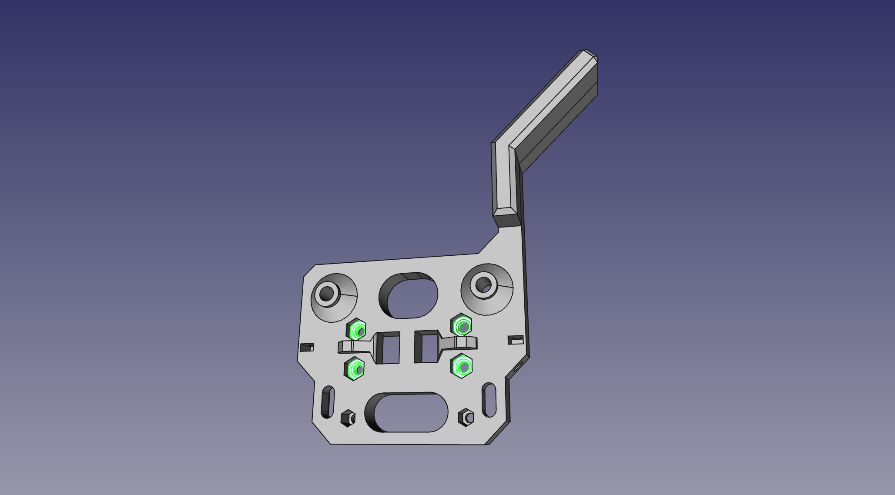

2. Ensure each hex nut is fully seated into their slot. It may be helpful to pull the hex nuts fully into location by screwing a M5x10mm machine screw into them from the opposite side of the `X Gantry Back`. Afterwards, remove the screw.

3. Insert four M3 Hex Nuts, two vertically and two horizontally into the slots on `X Gantry Back` as indicated below.
  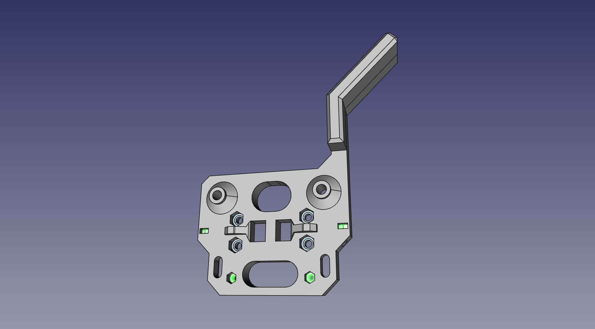

4. Insert six M3 Hex Nuts into the slots on the `X Gantry Front` as shown below.
  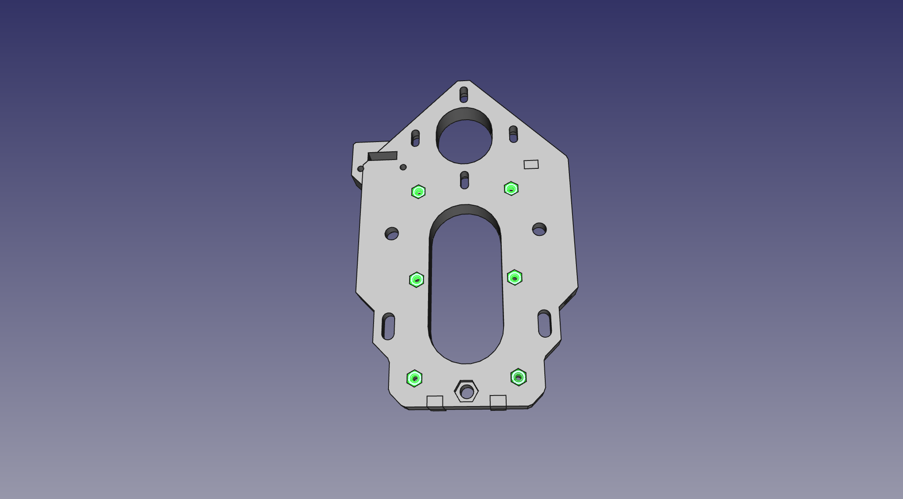

5. Insert two more M3 nuts into the vertical slots on the other side of the `X Gantry Front`.
  

6. Pull the hex nuts fully into location by screwing a M3x10mm machine screw into them from the opposite side of the `X Gantry Front`. Then unscrew the M3x10mm machine screw.

7. Insert a M5 Nylock Hex Nut into the slot at the bottom of the `X Gantry Front`.
  

## Attaching X Gantry Front and Back

| Qty | Part                     |
|----:|--------------------------|
|   2 | M5x40 machine screw      |
|   2 | FDM-0009 (Roller spacer) |
|   2 | V-slot roller wheel      |
|   2 | M5 Hex Nut               |

8. Insert two M5x40mm machine screws, one into each of the top two holes on the `X Gantry Front`.
  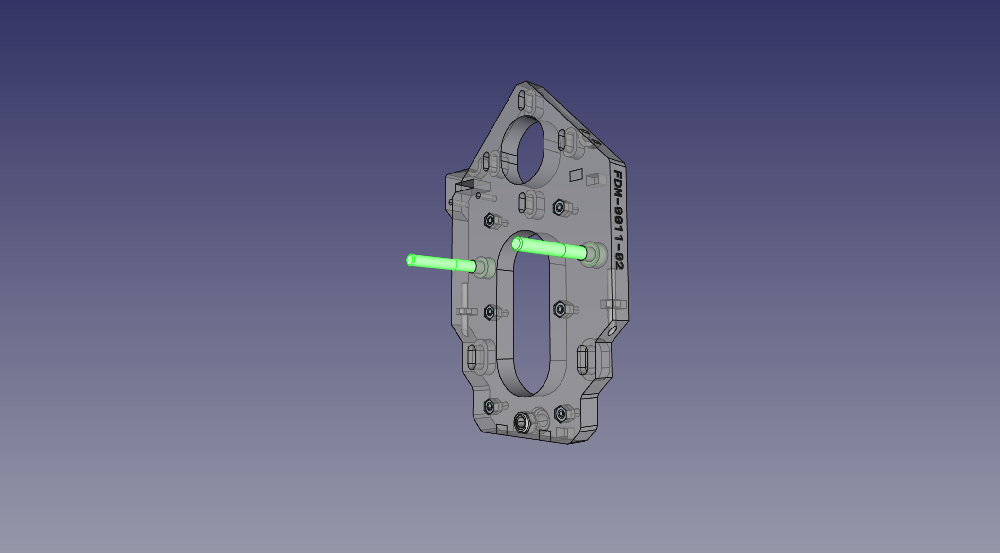

9. Slide a `Roller Spacer` onto each of the two machine screws.
  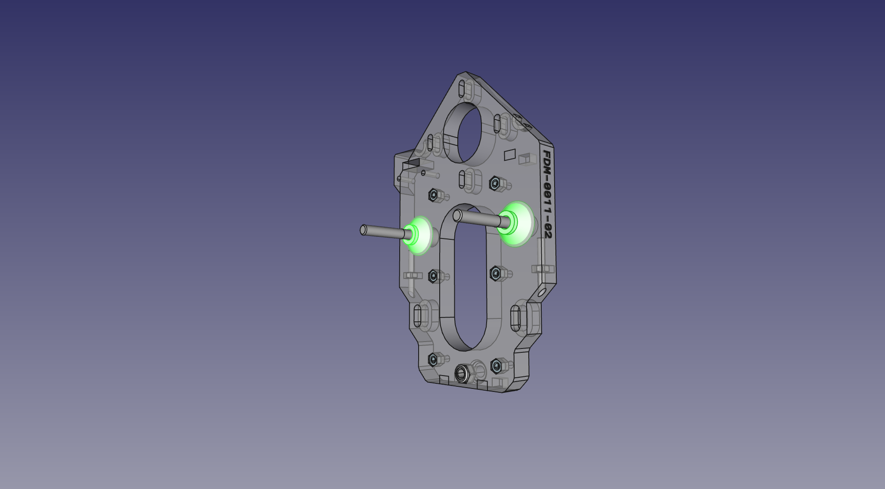

10. Slide a V-slot roller onto each of the two machine screws. Note: you may need to align one or both of the interior washers inside the rollers, as they can shift in shipping and block the hole for the screw. Simply push  the washers back into place with a screwdriver tip.
  
  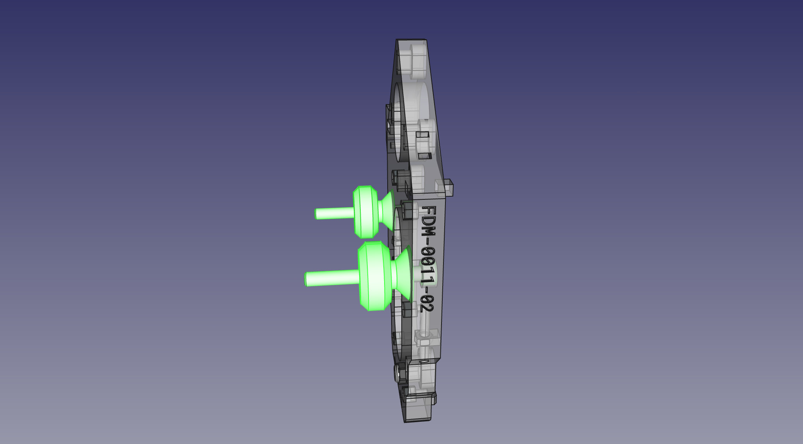

11. Place the `X Gantry Back` onto the two machine screws.
  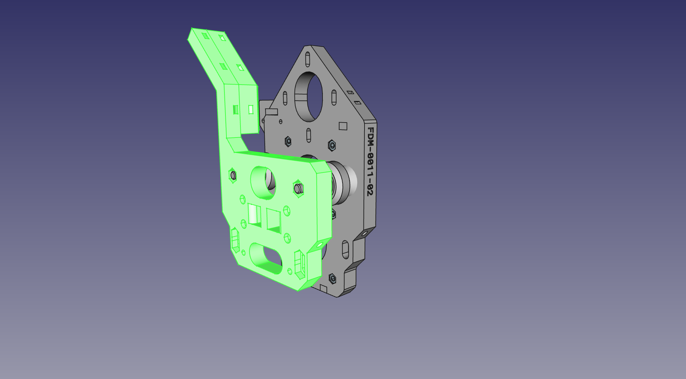

12. Install two M5 Hex Nuts, one into each of the slots on the `X Gantry Back`. Tighten the nuts on the machine screws so that the two sides are snug against the V-slot rollers.
  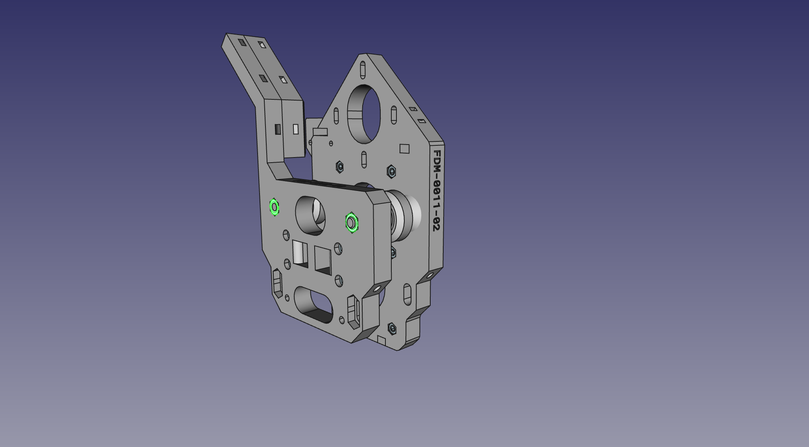

## Preparing for the Z Gantry

| Qty | Part                 |
|----:|----------------------|
|   2 | 100mm Linear Rail    |
|   6 | M3x14 machine screw  |
|   1 | NEMA17 stepper motor |
|   6 | M3x8 machine screw   |
|   1 | Limit switch PCB     |
|   1 | GT2 Pulley Idler     |
|   1 | M5x25 machine screw  |

13.  Carefully and safely remove the stoppers holding the gantry onto the linear rail. Depending on your kit, these could be metal clips or rubber stoppers inserted through the rail. Take care not to accidentally slide the bearings off of the linear rails after removing the stoppers. The bearings will be properly blocked from being removed after the linear rails are attached to the `X Gantry Front` and the Z-axis limit switch is installed.

14.  Place the two linear rails onto the front of the `X Gantry Front` and line up each one with the arrays of three holes on the left and right side. Place three M3x14mm machine screws into each of the rails (the holes on the ends first, then hole one in the middle) and tighten down.
  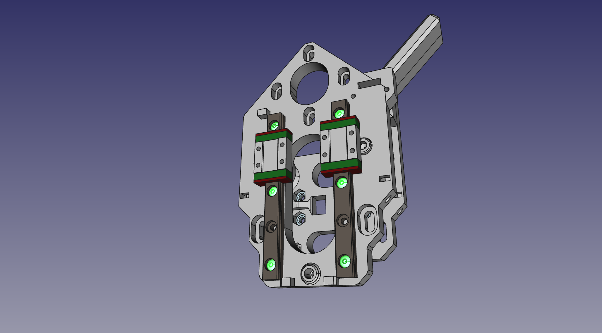

15. Place the NEMA 17 motor so the shaft runs through the `X Gantry Front`.
  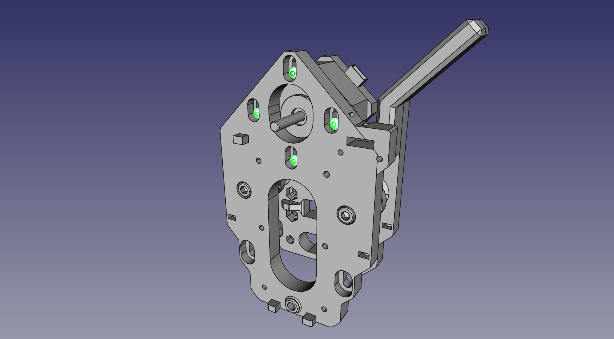
  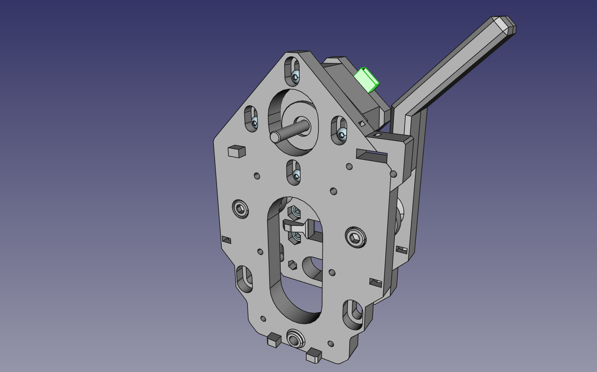

16. Attach the limit switch PCB with two M3x8mm screws at the top right of the `X Gantry Front`.
  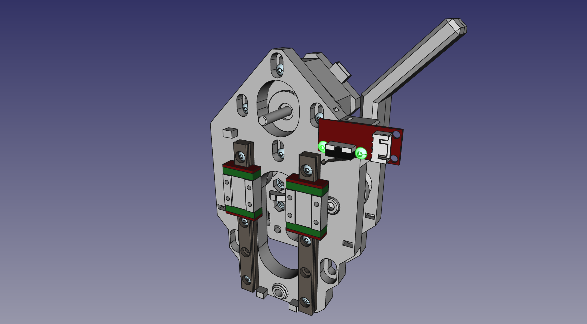

17. Slide a GT2 idler onto a M5x25mm machine screw. Thread that assembly through `X Gantry Front` and tighten on the Nyloc Hex Nut on the back side. Ensure that the fit is tight and there's no wiggle in the idler, but also make sure that it can spin freely and isn't seizing from over-tightening.
  

## Z Gantry Assembly

| Qty | Part                                |
|----:|-------------------------------------|
|   1 | FDM-0040 (Left Z Gantry Backplate)  |
|   1 | FDM-0041 (Right Z Gantry Backplate) |
|   1 | FDM-0017 (Left Z Gantry)            |
|   1 | FDM-0039 (Right Z Gantry)           |
|   1 | GT2 Timing Belt                     |
|   8 | M3x8 machine screw                  |
|   1 | GT2 Pulley (with grub screws)       |

Now it's time to mount the Z gantries. Each gantry comes in two parts. The first is a back plate that sits against the linear rail carriage, and connects to the timing belt, called `Left Z Gantry Backplate`. These will always be on your machine. Even when you swap toolheads, these will stay attached to the linear rail.

18. First, we need to get the GT2 timing belt inserted into the back plates at the right spacing. Insert the end of your GT2 belt **halfway** along the slot in the `Right Z Gantry Backplate` with 108mm of belt between them (when measuring from the edges of the prints). Your setup should look like the image below:
  

19. Now, cut the loose end of the belt such that there is 114mm remaining when measured from the edge of the print. Insert this loose end into the other backplate so that there are no empty teeth.

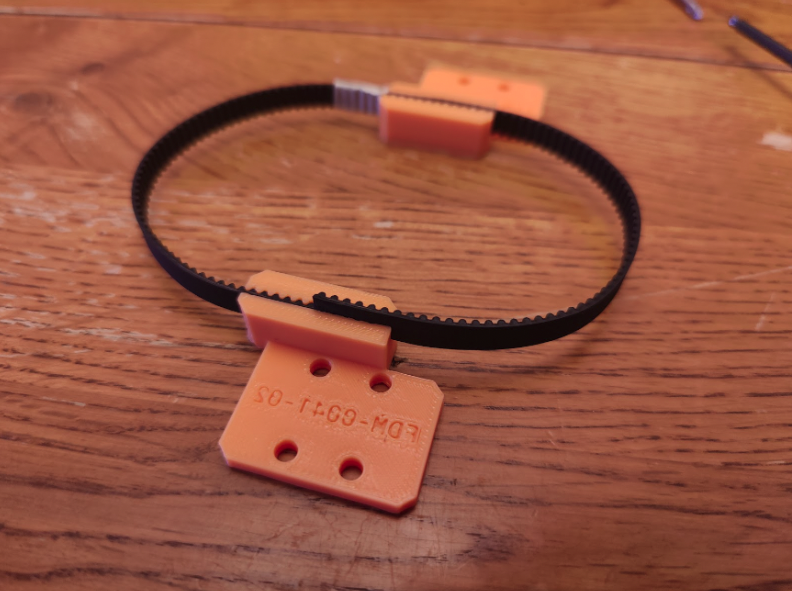

20.   Slide the GT2 Pulley onto the Z axis motor's shaft, with the set screws closer to the motor body. Don't tighten the set screws yet. Place backplate and belt assembly on linear rails, threading the belt through the pulley on the stepper motor. Ensure that the back plates are oriented as shown in the image below.

21.  Insert M5x40mm bolt with GT2 idler into bottom of plate, and thread the belt around it. Secure backplates temporarily with two M3x8mm bolts as shown below.

22.  Slide the Z motor up in its hardware slots and check for belt tension. If you're able to get the belt completely taut, great! If not, remove a loose end of the belt, snip off a belt rib from one side, reinsert, and try again. As long as you are able to get the belt taught from the movement of the stepper motor, you're good to move on.

23. While pulling upward on the Z stepper motor so that the belt is tesioned, tighten the four M3 bolts holding it to the X gantry.

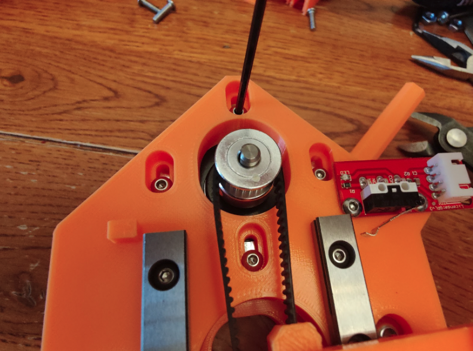

24. Finally, attach the left and right Z gantries to the back plates using M3x8mm bolts as shown below.

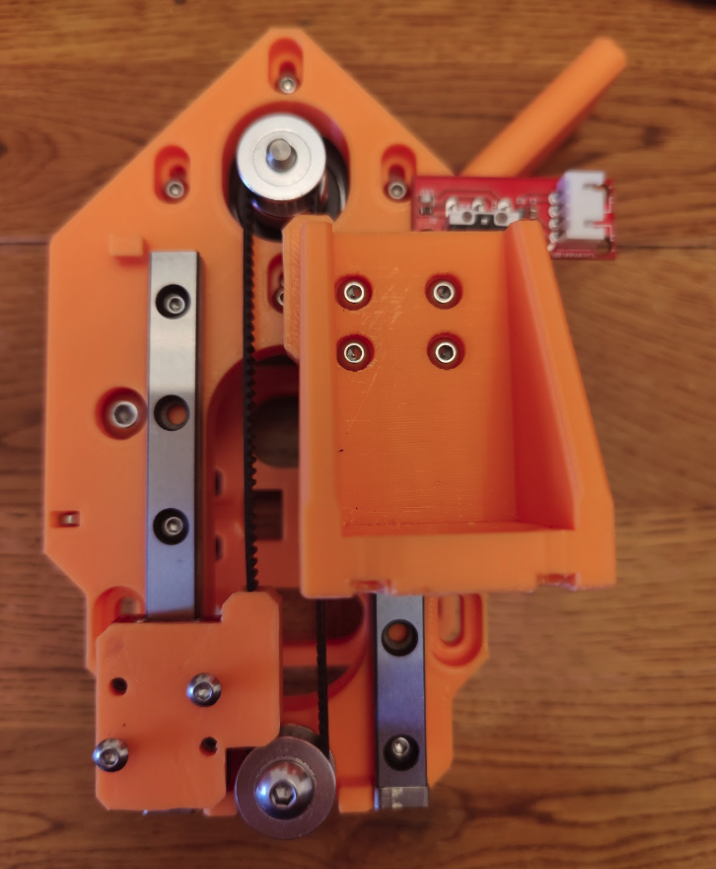

  

## Mounting the Z-axis tools

| Qty | Part                              |
|----:|-----------------------------------|
|   1 | NEMA11 hollow shaft stepper motor |
|   4 | M2.5x8 machine screw              |
|   1 | CP40 nozzle holder                |
|   1 | Pneumatic Couple                  |
|   4 | M5x10 machine screw               |
|   2 | FDM-0027 (Belt Clamp)             |

28. Now that our Z gantries are all tightened and moving freely, we can mount our final axis: rotation! Take your NEMA11 hollow shaft stepper motor and place it in the left Z gantry. Secure it in place with four M2.5x8mm screws. Make sure the wire port is facing outwards as shown below.
  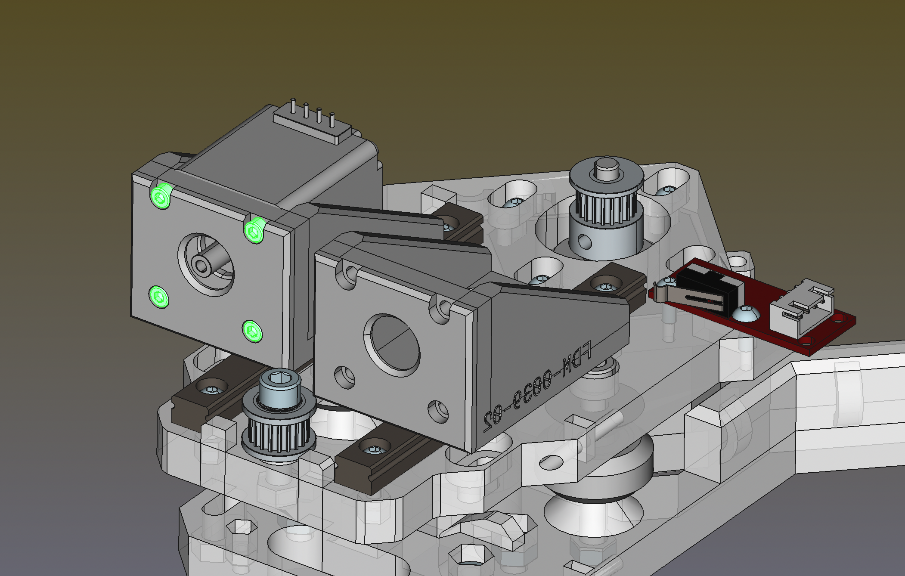

29. Now we'll mount a few bits of hardware to the hollow shaft motor. Screw the CP40 nozzle holder into the bottom side of the motor, and screw the press-fit pneumatic coupler into the top side.
  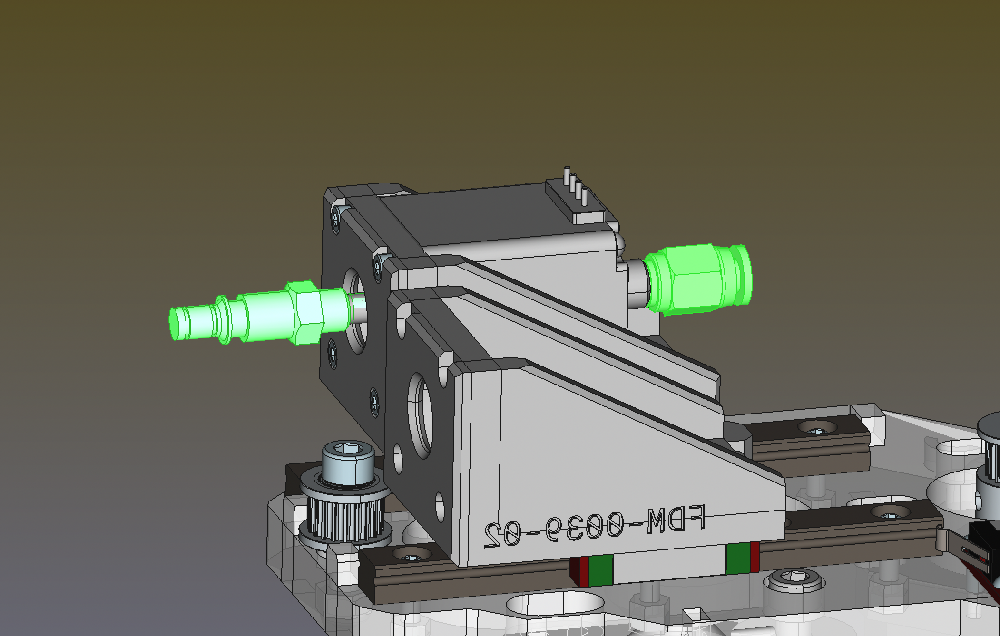

30. Use four M5x10mm screws to loosely attach two of your `Belt Clamps`.
  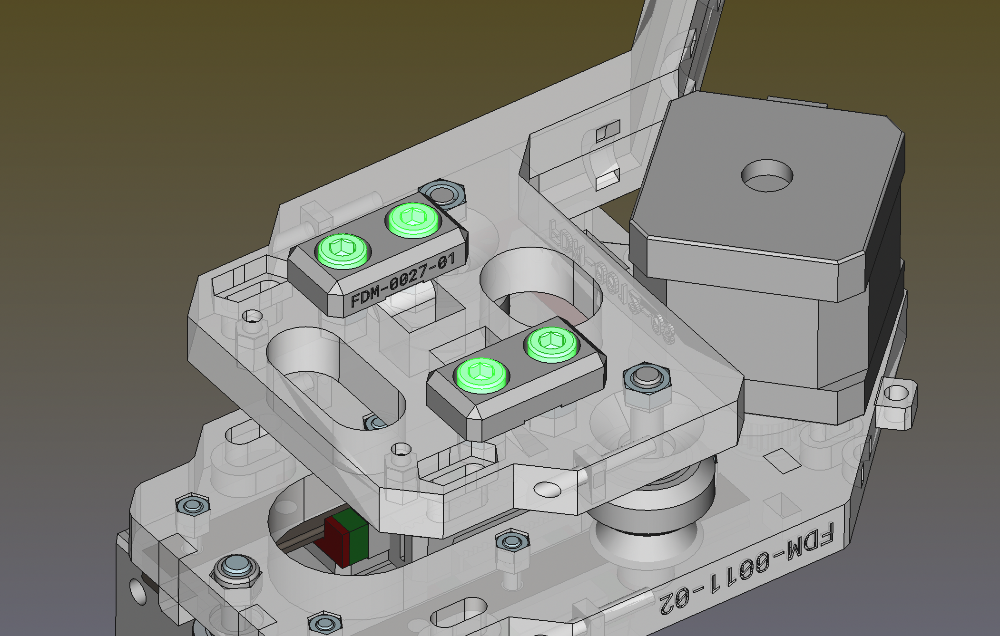

## Next steps

Continue to [mounting the X Gantry to the Y Gantry](../mount-x-to-y/index.md).