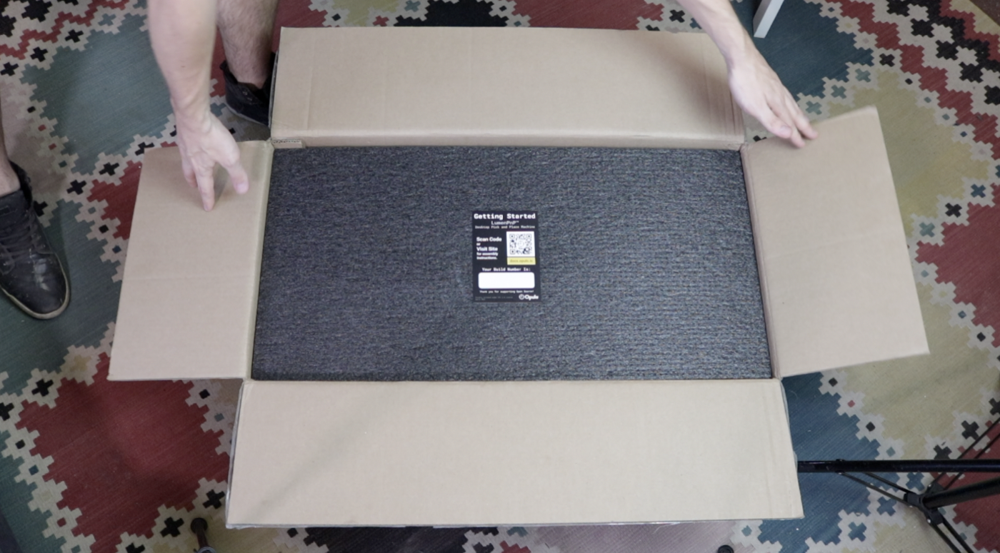
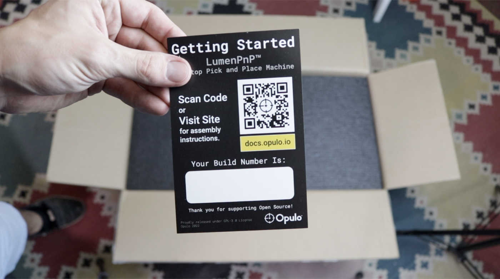
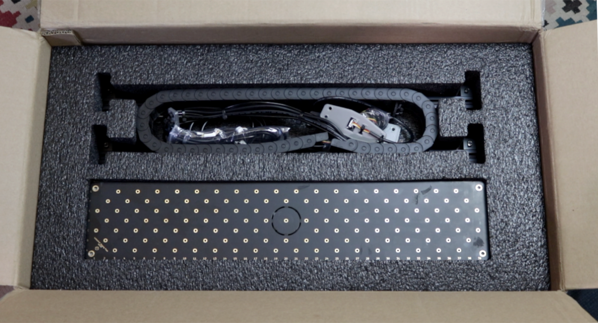
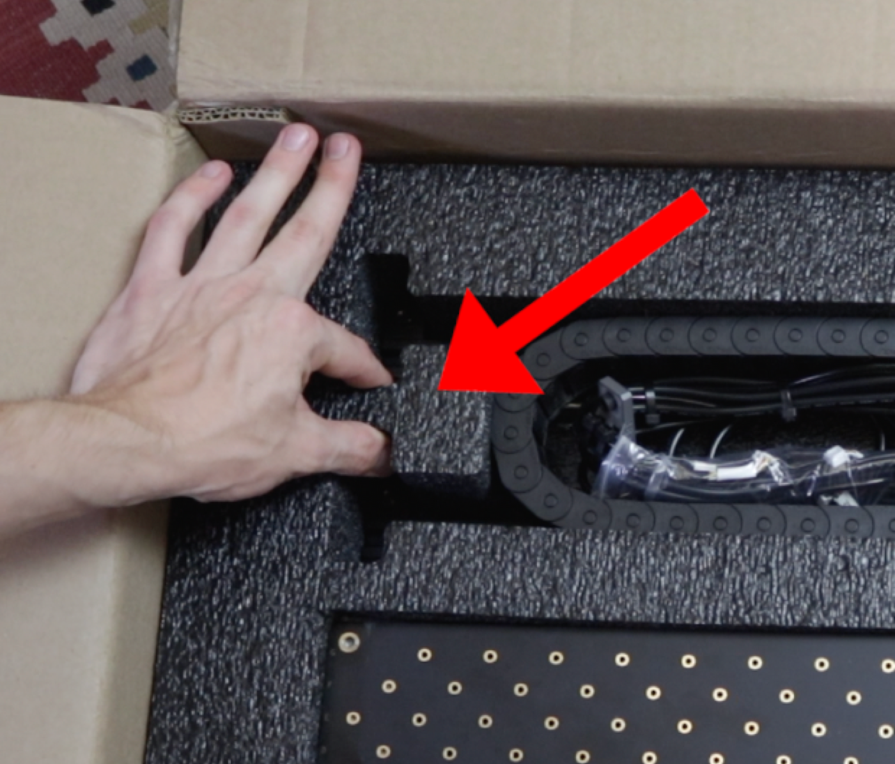
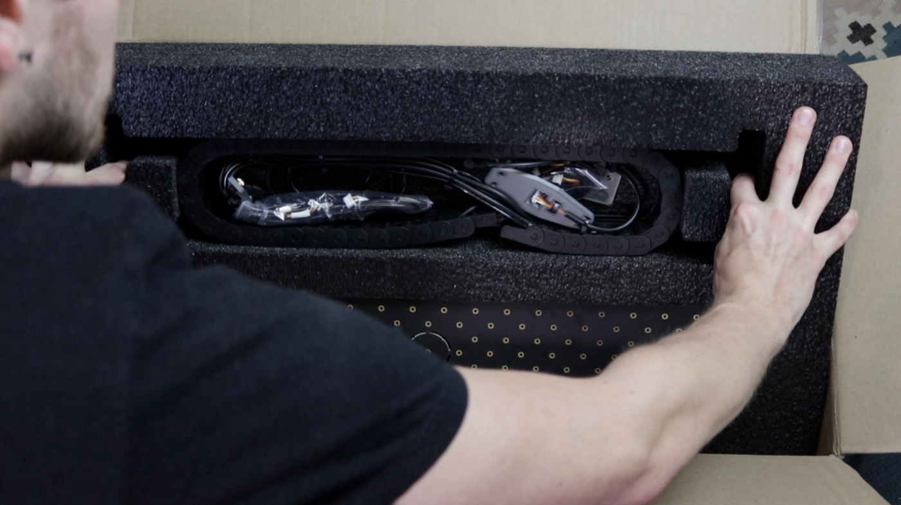
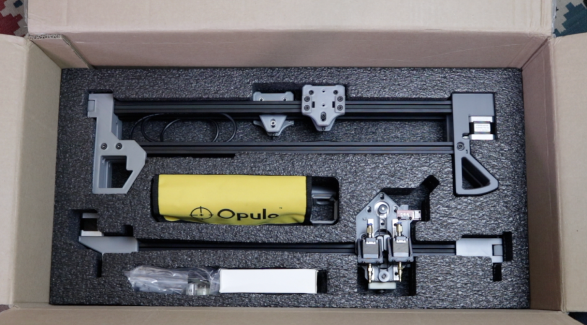
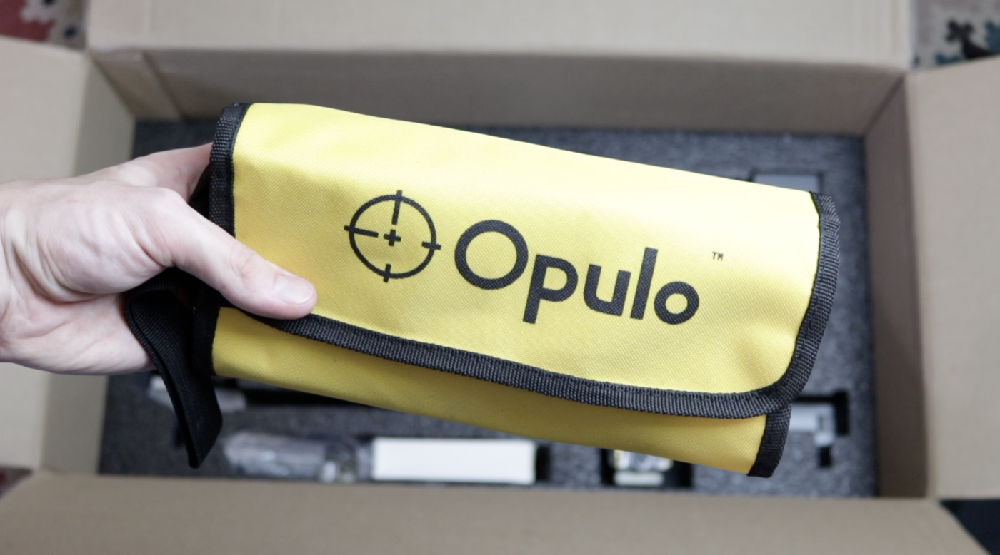
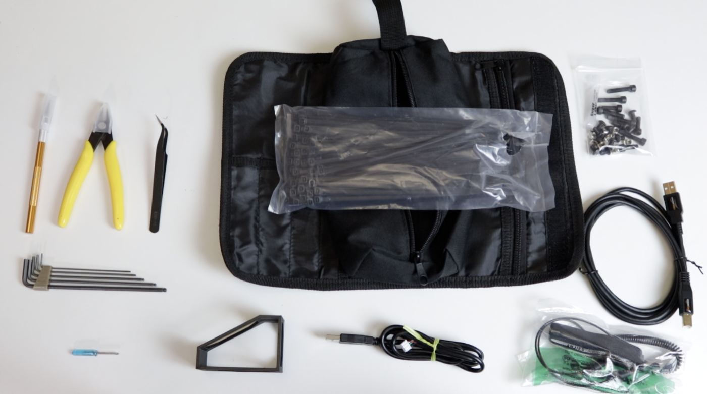

# Unboxing

1. First, take a look at what's in the box! The first thing you'll see when you open the package is the getting started card. This card has your machine's version number on it. Make sure your version number begins with `v3`.
   
   

2. Remove the top protective layer of foam revealing the first tray of components. This tray contains:
   
      + Staging plate
      + Build plate
      + Cable chain assembly
      + Cable chain frame mount
      + IEC power cable
      + Front rail
      + Back rail

3. Grab the foam as shown below, rotate the tray up, then pull it out and set it aside, revealing the second tray of parts.

4. The second tray contains the following parts:

      + Left and right leg assemblies
      + X gantry assembly
      + Feet for the build and staging plates
      + Power supply
      + Getting started kit
      + Tool bag
   

5. Open up the tool bag. Inside, you'll find the following items:
   
   
      + Hobby knife
      + Flush snips
      + 135 degree tweezers
      + Allen wrench set
      + Small Phillips screwdriver
      + Alignment bracket
      + Bottom camera cable
      + ESD wrist strap
      + USB-A to USB-B cable
      + Hardware bag
      + Zip ties

## Next Steps

Alright, let's move on to [assembling the frame](../assembling-frame/index.md).
